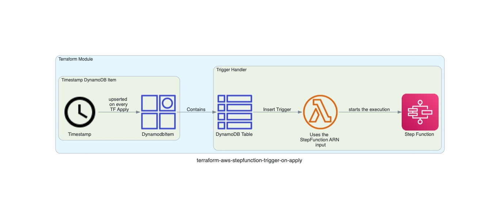

# terraform-aws-stepfunction-trigger-on-apply

## Introduction 

Terraform module that triggers the execution of the step function on every Terraform Apply. Utilizes the DynamoDB Streams to trigger AWS Lambda which starts the Step Function execution.



## Usage

```
provider "aws" {
  region = "us-east-1"
  default_tags {
    tags = var.tags
  }
}

module "this" {
  source = "../../"

  stepfunction_arn = var.stepfunction_arn
}
```